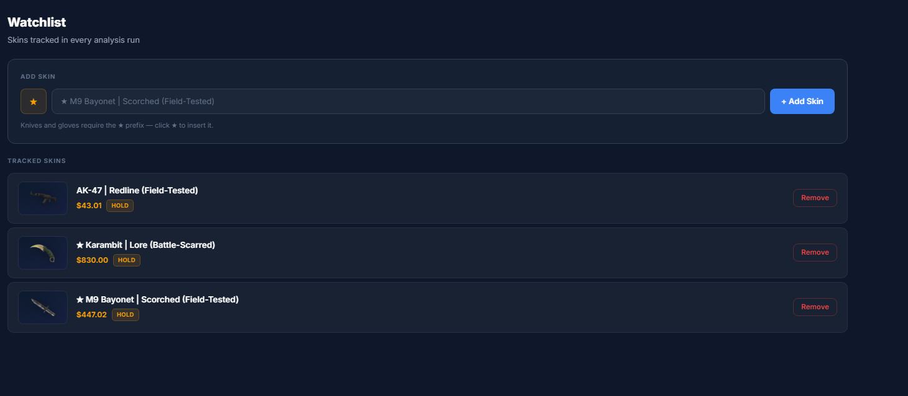
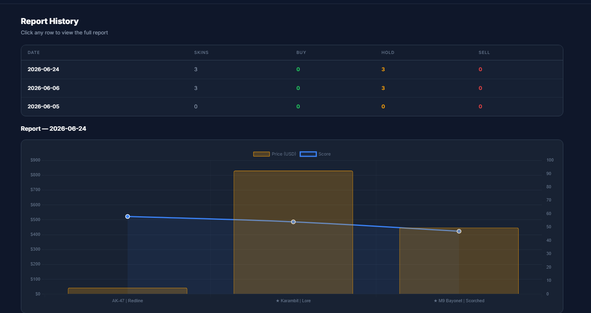

# CS2 Market Analysis

AI-powered CS2 skin price tracker. Pulls market data from Steam, CSFloat, Skinport, and Buff163, runs Claude analysis, and pushes a daily decision dashboard to Discord.

---

<table>
  <tr>
    <td></td>
    <td></td>
  </tr>
  <tr>
    <td></td>
    <td></td>
  </tr>
</table>

---

## Quick Start

### GitHub Actions (recommended — zero infra)

1. Fork this repo
2. Go to **Settings → Secrets and variables → Actions** and add:

| Secret | Description |
|--------|-------------|
| `SKIN_LIST` | Comma-separated skin names, e.g. `AK-47 \| Redline (Field-Tested),★ Karambit \| Lore (Field-Tested)` |
| `ANTHROPIC_API_KEY` | Claude API key (or set `OPENAI_API_KEY`) |
| `DISCORD_WEBHOOK_URL` | Discord channel webhook URL |

3. Enable Actions → manually trigger **Daily CS2 Skin Analysis** to test

### Local

```bash
git clone https://github.com/koleluo/CS2-market-analysis
cd CS2-market-analysis
pip install -r requirements.txt
cp .env.example .env   # fill in your keys
python main.py
```

### Common commands

```bash
python main.py                                           # run analysis + notify
python main.py --skins "AK-47 | Redline (Field-Tested)" # override watchlist
python main.py --dry-run                                 # skip notifications
python main.py --debug                                   # verbose logging
python main.py --schedule                                # cron loop (local)
python main.py --serve-only                              # web UI at localhost:8000
```

## Data Sources

| Source | Data | Auth required |
|--------|------|---------------|
| Steam Market | Current price, 24h volume | None |
| Skinport | Suggested price, avg sale | None (optional key) |
| CSFloat | Float distribution, listings | Optional API key |
| Buff163 | CN market price | `BUFF_COOKIE` env var |

## Environment Variables

See [`.env.example`](.env.example) for all options.

## Output Example

```
🎮 2026-06-06 CS2 Skin Dashboard
Analyzed 3 skin(s) | 🟢 Buy: 1  🟡 Hold: 1  🔴 Sell: 1

🟢 ★ Karambit | Lore (FT) — BUY | Score: 78 | Rising
🟡 AK-47 | Redline (FT) — HOLD | Score: 55 | Sideways
🔴 ★ M9 Bayonet | Scorched (FT) — SELL | Score: 32 | Falling
```
